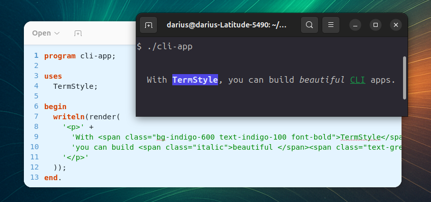

# TermStyle

**TermStyle** brings **colorful, styled output** to your CLI applications with the familiar **[Tailwind CSS](https://tailwindcss.com/) API**. It allows building a **beautiful and expressive terminal** with ease.

> TermStyle is inspired by [Termwind](https://github.com/nunomaduro/termwind).

<p align="center">
    
</p>

## Installation

Install using [Nova](https://github.com/nova-packager/nova).

```bash
nova require daar/termstyle
```

## Usage

**TermStyle** accepts valid HTML and Tailwind formatting classes.

```pascal
uses
  TermStyle;

Writeln(render('<div class="font-bold text-red">Important!</div>'));
Writeln(render('<div class="text-green-500 bg-gray-800">Green text on dark background</div>'));
````

### `prompt()`

The `prompt()` function may be used to prompt the user with a question.

```pascal
function prompt(const Msg: string; const AClasses: string = 'text-fuchsia-500'): string;
```

### Message helpers

TermStyle comes with ready-to-use helpers that print messages styled by their severity.

```pascal
procedure error(const Msg: string; const AClasses: string = 'bg-red-700 text-red-100 font-bold');
procedure success(const Msg: string; const AClasses: string = 'bg-green-700 text-green-100 font-bold');
procedure warning(const Msg: string; const AClasses: string = 'bg-yellow-700 text-yellow-100 font-bold');
procedure info(const Msg: string; const AClasses: string = 'bg-sky-700 text-sky-100 font-bold');
procedure banner(const Msg: string; const AClasses: string = 'bg-sky-700 text-sky-100 font-bold');
```

### `banner()`

The `banner()` function may be used to show a banner on screen with a custom HTML formatting.

```pascal
banner('TERMSTYLE DEMO CLI', 'text-white bg-blue-400 font-bold'); 
```


## Classes Supported

All the classes supported use exactly the same logic that is available on [tailwindcss.com/docs](https://tailwindcss.com/docs).

* **[Background Color](https://tailwindcss.com/docs/background-color):** `bg-{color}-{shade}`.
* **[Text Color](https://tailwindcss.com/docs/text-color):** `text-{color}-{shade}`.
* **[Font Weight](https://tailwindcss.com/docs/font-weight#class-reference):** `font-bold`, `font-normal`.
* **[Font Style](https://tailwindcss.com/docs/font-style#italics):** `italic`.
* **[Text Decoration](https://tailwindcss.com/docs/text-decoration):** `underline`, `line-through`.
* **[Text Transform](https://tailwindcss.com/docs/text-transform):** `uppercase`, `lowercase`, `capitalize`, `snakecase`, `normal-case`.
* **[Margin](https://tailwindcss.com/docs/margin):** `m-{margin}`, `ml-{leftMargin}`, `mr-{rightMargin}`, `mt-{topMargin}`, `mb-{bottomMargin}`, `mx-{horizontalMargin}`, `my-{verticalMargin}`.
* **[Padding](https://tailwindcss.com/docs/padding):** `p-{padding}`, `pl-{leftPadding}`, `pr-{rightPadding}`, `pt-{topPadding}`, `pb-{bottomPadding}`, `px-{horizontalPadding}`, `py-{verticalPadding}`.
* **[List Style](https://tailwindcss.com/docs/list-style-type):** `list-disc`, `list-decimal`, `list-square`, `list-none`.


## HTML Elements Supported

All the elements have the capability to use the `class` attribute.

### `<div>`

The `<div>` element can be used as a block type element.

```pascal
render('<div>This is a div element.</div>');
```

### `<p>`

The `<p>` element can be used as a paragraph.

```pascal
render('<p>This is a paragraph.</p>');
```

### `<span>`

The `<span>` element can be used as an inline text container.

```pascal
render(
    '<p>' +
    'This is a CLI app built with <span class="text-green-300">TermStyle</span>.' +
    '</p>'
  );
```

### `<a>`

The `<a>` element can be used as a hyperlink. It allows to use the `href` attribute to open the link when clicked.

**Default Styles**: `text-blue-500`

```pascal
render(
    '<p>' +
    'This is a CLI app built with TermStyle. <a href="/">Click here to open</a>' +
    '</p>'
  );
```

### `<b>` and `<strong>`

The `<b>`and `<strong>` elements can be used to mark the text as **bold**.

**Default Styles**: `font-bold`

```pascal
render(
    '<p>' +
    'This is a CLI app built with <b>TermStyle</b>' +
    '</p>'
  );
```

### `<i>` and `<em>`

The `<i>` and `<em>` elements can be used to mark the text as *italic*.

**Default Styles**: `italic`

```pascal
render(
    '<p>' +
    'This is a CLI app built with <i>TermStyle</i>.' +
    '</p>'
  );
```

### `<s>`

The `<s>`  element can be used to add a ~~line through~~ the text.

**Default Styles**: `line-through`

```pascal
render(
    '<p>' +
    'This is a CLI app built with <s>TermStyle</s>.' +
    '</p>'
  );
```
### `<ul>`

The `<ul>` element can be used for an unordered list. It can only accept `<li>` elements as childs, if there is another element provided it will throw an `InvalidChild` exception. 

**Default Styles**: `list-disc`

```pascal
render(
    '<ul>' + 
    '    <li>Item 1</li>' + 
    '    <li>Item 2</li>' + 
    '</ul>'
);
```

### `<ol>`

The `<ol>` element can be used for an ordered list. It can only accept `<li>` elements as childs, if there is another element provided it will throw an `InvalidChild` exception. 

**Default Styles**: `list-decimal`

```pascal
render(
    '<ol>' + 
    '    <li>Item 1</li>' + 
    '    <li>Item 2</li>' + 
    '</ol>'
);
```

### `<li>`

The `<li>` element can be used as a list item. It should only be used as a child of `<ul>` and `<ol>` elements.

**Default Styles**: `list-decimal`

```pascal
render
    '<ul>' + 
    '    <li>Item 1</li>' + 
    '</ul>'
);
```